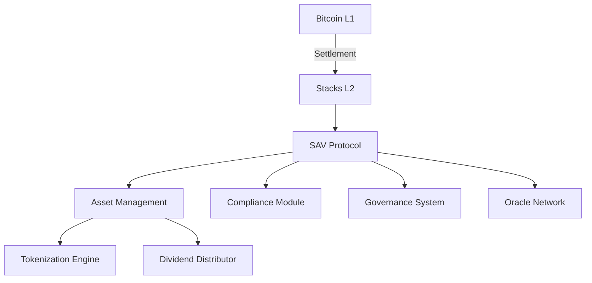

# 📦 Stacks Asset Vault (SAV)

**SAV** is a **Bitcoin-backed, institution-grade asset management protocol** deployed on **Stacks Layer 2 (L2)**. It enables compliant tokenization, secure governance, and automated dividend flows—anchored in **Bitcoin settlement finality**.

## 🧩 Overview

Built for asset issuers, custodians, and financial institutions, SAV fuses **Bitcoin's security** with **Stacks' smart contract programmability** to offer:

* Regulatory-compliant token issuance
* On-chain governance with Bitcoin-finalized voting
* Automated, pro-rata dividend distributions
* Oracle-driven asset pricing
* KYC/AML enforcement (FATF-aligned)

## 🔐 Key Features

| Feature                    | Description                                                           |
| -------------------------- | --------------------------------------------------------------------- |
| **Bitcoin Settlement**     | All asset operations finalize via Bitcoin L1 using Stacks as Layer 2. |
| **Compliant Architecture** | Tiered KYC (0–5), auto-expiring credentials, on-chain audit trails.   |
| **Tokenized Assets**       | Unique metadata, fixed supply, and time-locked asset control.         |
| **Dividend Engine**        | Proportional payouts with claim tracking and history.                 |
| **Governance System**      | Proposal creation, weighted voting, and quorum thresholds.            |
| **Oracle Integration**     | Freshness-checked price feeds from decentralized data providers.      |

---

## 🏗️ Architecture



### Core Modules

* **Asset Vault Core**: Asset registration, dividend distribution, and lock controls.
* **Compliance Layer**: KYC level registry, expiration logic, and off-chain attestation binding.
* **Governance Engine**: Proposal lifecycle management, token-weighted voting, execution logic.
* **Oracle Gateway**: Decentralized price feed with staleness and integrity checks.

---

## 🧠 Smart Contract Structure

### 🔹 Data Models

```clarity
;; Asset Struct
(struct Asset {
  owner: principal
  metadata-uri: (string-ascii 256)
  asset-value: uint
  is-locked: bool
  creation-height: uint
  total-dividends: uint
})

;; Proposal Struct
(struct Proposal {
  title: (string-ascii 256)
  asset-id: uint
  start-height: uint
  end-height: uint
  executed: bool
  votes-for: uint
  votes-against: uint
  minimum-votes: uint
})
```

### 🔸 Core Functions

| Category             | Function               | Purpose                                           |
| -------------------- | ---------------------- | ------------------------------------------------- |
| **Asset Management** | `register-asset`       | Mint institution-grade asset with metadata/value. |
|                      | `lock-asset`           | Freeze asset by time or event.                    |
|                      | `update-metadata`      | Modify asset metadata (if allowed).               |
| **Dividends**        | `distribute-dividends` | Trigger dividend pool for eligible holders.       |
|                      | `claim-dividends`      | Allow users to claim based on recorded balance.   |
| **Governance**       | `create-proposal`      | Initiate governance change tied to an asset.      |
|                      | `cast-vote`            | Vote with token-weighted authority.               |
|                      | `execute-proposal`     | Finalize vote after time-lock and quorum check.   |
| **Oracle**           | `update-price-feed`    | Publish or validate asset price on-chain.         |

---

## ✅ Compliance & KYC

### KYC Model

```clarity
(define-map kyc-status
  { address: principal }
  { is-approved: bool, level: uint, expiry: uint }
)
```

### Verification Flow

1. Off-chain provider conducts identity verification.
2. SAV receives signed attestation.
3. On-chain KYC credential is minted with tier + expiry.
4. Credentials expire automatically; operations denied post-expiry.

---

## 🛡️ Security Model

| Control                   | Details                                                         |
| ------------------------- | --------------------------------------------------------------- |
| **Bitcoin Finality**      | 144-block (\~24h) delay for sensitive actions.                  |
| **Asset Limits**          | Max per-asset value: `1e12 sats` (1M BTC); min unit: 1000 sats. |
| **Oracle Freshness**      | Must refresh every 144 blocks; stale data triggers halt.        |
| **Governance Safeguards** | Quorum enforcement; time-locks to prevent flash governance.     |

---

## 🧪 Development & Testing

### Prerequisites

* [Clarity CLI](https://docs.stacks.co/write-smart-contracts/clarity-cli)
* [Clarinet](https://github.com/hirosystems/clarinet)
* Stacks Testnet or Devnet
* [Hiro Wallet](https://www.hiro.so/wallet) for interaction

### Local Setup

```bash
git clone https://github.com/your-org/stacks-asset-vault.git
cd stacks-asset-vault
clarinet check
clarinet test
```

### Key Test Cases

* ✅ Asset registration
* ✅ KYC enforcement + expiry validation
* ✅ Dividend distribution + claiming logic
* ✅ Proposal voting thresholds
* ✅ Oracle freshness enforcement

---

## 💡 Usage Examples

### Create Asset

```clarity
(register-asset 
  "https://metadata.example/asset123" 
  100000000  ;; 1 BTC
)
```

### Submit Proposal

```clarity
(create-proposal 
  1  ;; asset-id
  "Update dividend policy" 
  72  ;; 12hr voting period
  50000  ;; minimum 50k votes
)
```

### Claim Dividends

```clarity
(claim-dividends 1)  ;; asset-id
```

---

## 🧾 Constants Summary

| Constant           | Value     | Purpose                             |
| ------------------ | --------- | ----------------------------------- |
| `MAX-ASSET-VALUE`  | 1e12 sats | Cap per asset value (1M BTC)        |
| `MAX-KYC-LEVEL`    | 5         | FATF-compliant identity levels      |
| `MAX-DURATION`     | 144       | Max governance duration (\~24 hrs)  |
| `tokens-per-asset` | 100,000   | Fixed supply per asset (for voting) |

---

## 🚀 Roadmap & Extensions

* [ ] Multi-asset dividend distribution
* [ ] SIP-010 compatibility for asset tokens
* [ ] sBTC or DLC-based cross-chain proof integrations
* [ ] NFT-style on-chain metadata support

---

## 🤝 Contributing

We welcome contributions from developers, institutions, and auditors. Open an issue, fork the repo, and send a pull request.
